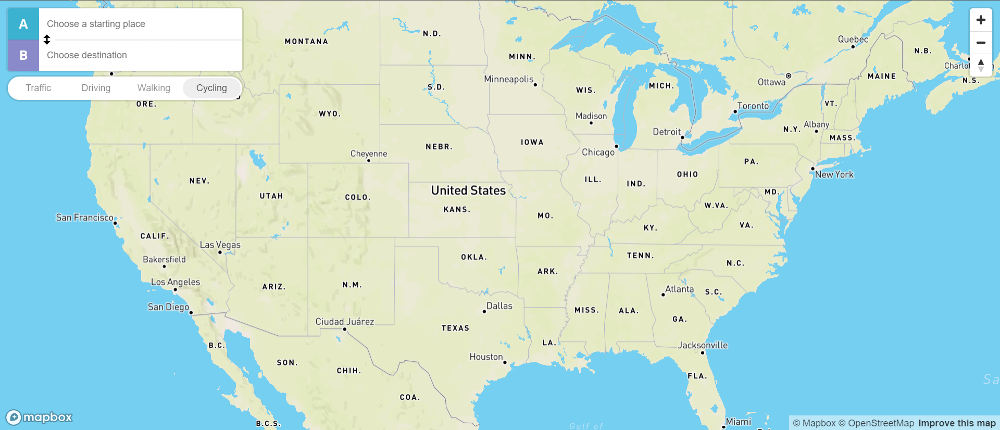

# Google Maps Clone


## Table of Contents
1. [About](#about)
2. [Video](#video)
3. [Tech](#tech)
4. [Features](#features)
5. [Getting Started](getting-started)
6. [Code Examples](code-examples)
7. [Status](#status)
8. [Why](#why)
9. [Contact](#contact)
10. [License](#license)


## About
A simple Google Maps clone built using Mapbox, allows users to view and navigate a map, find their current location, and get directions. This project demonstrates how to integrate Mapbox's powerful mapping services into a web application.

## Video
[Watch the demo](https://drive.google.com/file/d/1gG1ZQGPAXQlPg-q4xdXVXJS5PI5EsfXt/view?usp=sharing)

## Tech 
-HTML5
-CSS3
- JavaScript ES6
- **Mapbox GL JS:** For rendering the map and handling geolocation.
- **Mapbox Directions API:** For fetching and displaying cycling directions.

## Features
- **Interactive Map:** Navigate through the map using zoom and drag controls.
- **User Location:** Automatically detects and centers the map on the user's current location using the browser's geolocation API.
- **Directions:** Provides cycling directions from the user's current location to a specified destination.

## Getting Started

### Prerequisites
- A web browser

### Usage
You can access the live version of the application here: [Live Demo](https://ad-google-maps-clone.netlify.app/)

### Cloning the Repository (Optional)
If you still want to clone the repository and explore the code:
1. Clone the repository:  `git clone https://github.com/YourUsername/google-maps-clone.git`
2. Navigate to the project directory: `cd google-maps-clone`
3. Open the project: `Open index.html in your preferred web browser`

## Code Examples
```javascript
const successLocation = (position) => {
  console.log(position);
  setupMap([position.coords.longitude, position.coords.latitude]);
};

const errorLocation = () => {
  setupMap([]);
};

navigator.geolocation.getCurrentPosition(successLocation, errorLocation, {
  enableHighAccuracy: true,
});
```

## Status
Complete

## Why
This project was built to enhance my understanding of mapping technologies and geolocation services. 
Additionally, it serves as a portfolio piece showcasing my ability to implement real-world functionality using modern web technologies.

## Contact:
- Email: `adriennerdaniels@gamil.com`
- LinkedIn: `https://www.linkedin.com/in/adriennerdaniels/`
- GitHub: `Adrienner1988`

## License
This project is currently not licensed.
